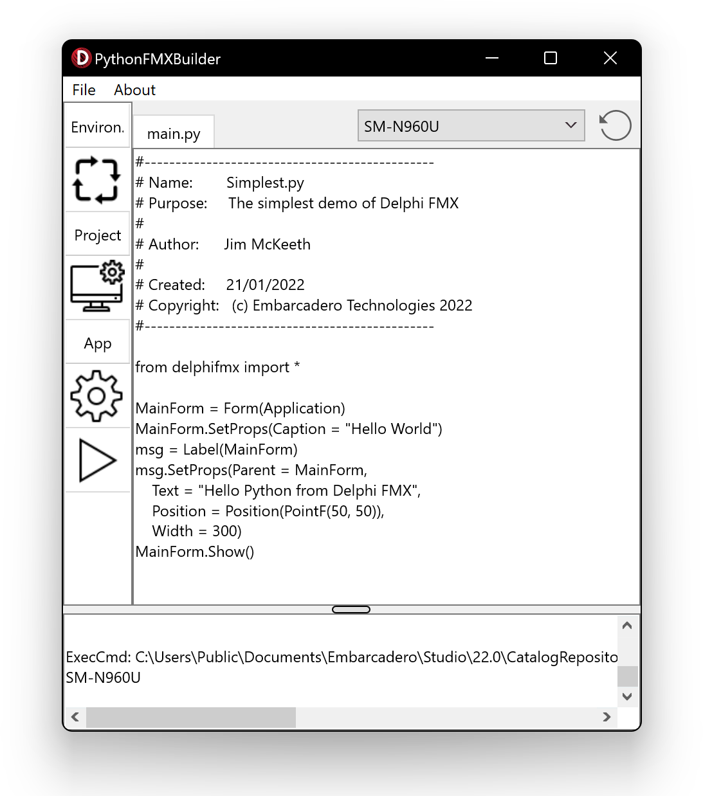
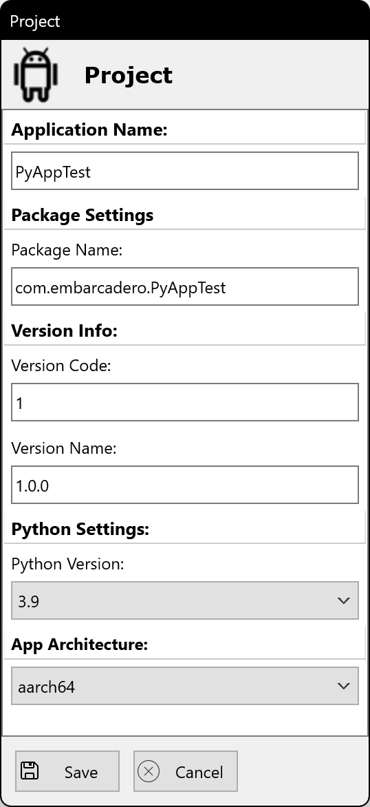
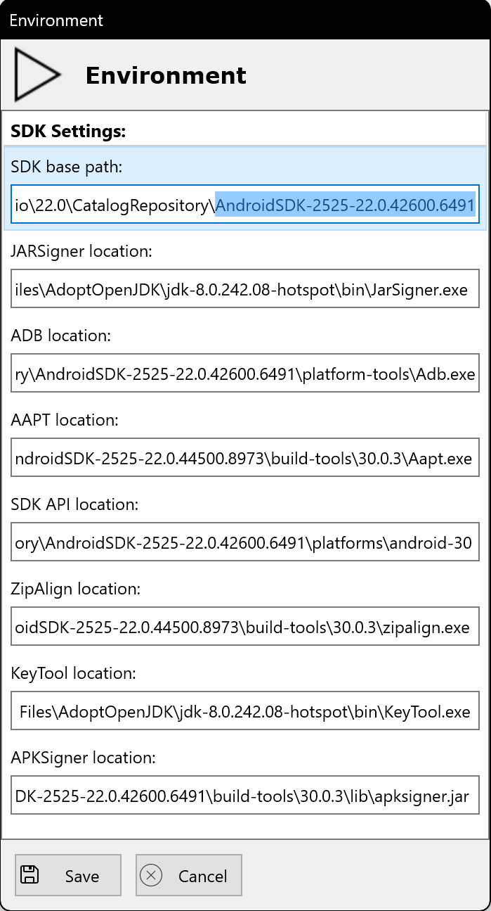

# [PythonFMXBuilder](https://github.com/Embarcadero/PythonFMXBuilder)
An application builder for Python using DelphiFMX for Python for targeting Android. For use with [DelphiFMX](https://github.com/Embarcadero/DelphiFMX4Python).

Wraps a Python script into an Android application for using on device.

## Screenshots
The application has a GUI to simplify navigation and usage.

### Main Window
Edit your Python script, or load it from a file.

### Project Settings
Configure settings for your project.

### Enviroment Setup
Specify the locations for the JDK and Android SDK

