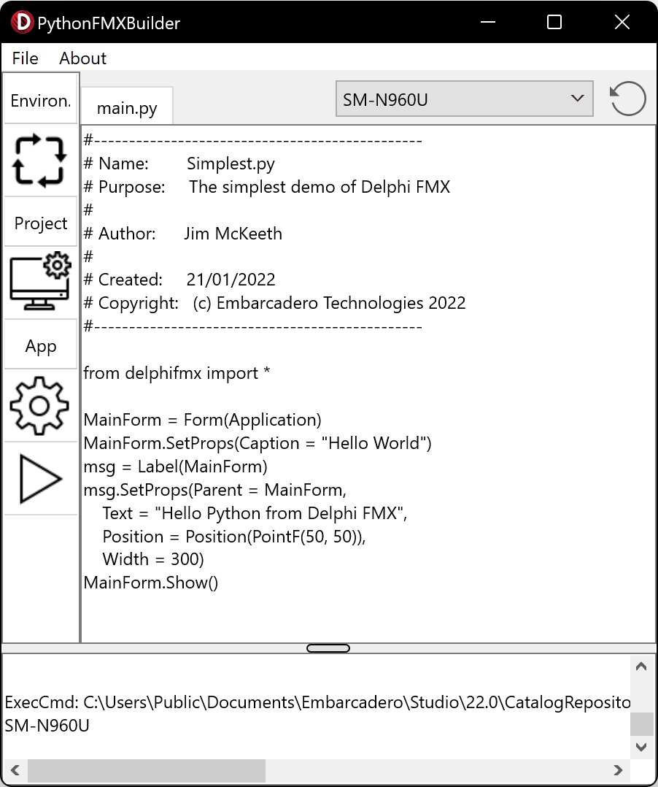

# <a href="https://github.com/Embarcadero/PythonFMXBuilder">PythonFMXBuilder</a>
An application builder for Python using [DelphiFMX for Python](https://github.com/Embarcadero/DelphiFMX4Python) for targeting Android. Allows you to bundle a custom Python script into an Android app, deploy it to your phone, or submit it to the app store.
 
* [Requirements](#requirements)
* [Screenshots](#screenshots)
* [Releases](https://github.com/Embarcadero/PythonFMXBuilder/releases)
 
## eBook, Webinar, and Styles Bundle

There is an free [eBook and styles bundle](https://embt.co/PythonGUIBundle) with 29 custom styles and 50 pages of content.
 <a href="https://embt.co/PythonGUIBundle"></a>
 
 **Webinar:** <a href="https://attendee.gotowebinar.com/register/3633463041072258318?source=github">Tkinter vs. DelphiFMX for Python GUI - Embarcadero Open Source Live Stream</a> - Thursday, Jun 2, 2022 at 10:00 AM CDT
<a href="https://attendee.gotowebinar.com/register/3633463041072258318?source=github"></a>

## Requirements
While PythonFMXBuilder is made with Delphi, it does not require Delphi to use. 

1. Download the latest release
   * We provide prebuild [binaries in releases](https://github.com/Embarcadero/PythonFMXBuilder/releases)
3. Install Java's JDK 
   * You may already have this
   * Tested with [Adopt Open JDK](https://adoptopenjdk.net/?variant=openjdk8&jvmVariant=hotspot) v8 with Hotspot JVM
4. Install the [Android SDK](https://developer.android.com/studio#downloads)
   * If you don't alreayd have it, then you only need the **Command line tools** from the bottom of the list and not the full Android Studio.
   * You can use the [sdkmanager command-line](https://developer.android.com/studio/command-line/sdkmanager) tool to install as follows
     
     ```
     sdkmanager "cmdline-tools;latest" "platform-tools" "platforms;android-30"
     ```
   * The installed package list should look something like the following

      **Path**               | **Version** | **Description**                           | **Location**
      -------                | ------------| -------                                   | -------
      `cmdline-tools;latest` | `7.0`       | `Android SDK Command-line Tools (latest)` | `cmdline-tools\latest\`
      `platform-tools`       | `33.0.1`    | `Android SDK Platform-Tools`              | `platform-tools\`
      `platforms;android-30` | `3`         | `Android SDK Platform 30`                 | `platforms\android-30\`


## Screenshots
The application has a GUI to simplify navigation and usage. Consult the following screenshots for a brief overview of it's functions.

### Main Window
Edit your Python script, or load it from a file.



### Project Settings
Configure settings for your project.


### Enviroment Setup
Specify the locations for the JDK and Android SDK


